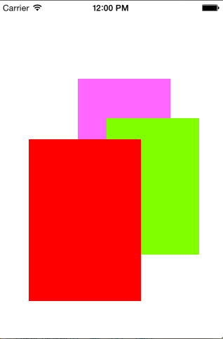
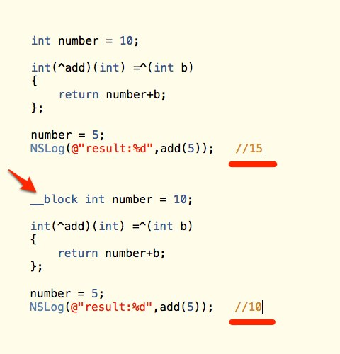

# Objective-C tips


[TOC]

## Define and use private property

``` objectivec
// in ViewController.m
@interface ViewController (){
    NSString *Name;
    }
@end

-(void) ShowMessage{
  _Name="Hello World";
  [self.Name]="Hello World";

}
```

## Dismiss keyboard

### call resignFirstResponser

```objectivec
- (BOOL)resignFirstResponder
```
Notifies the receiver that it has been asked to relinquish its status as first responder in its window.
``` objectivec
[self.textInput resignFirstResponder]
```
    
### Touch screen dismiss keyboard

```objectivec
-(void)touchesBegan:(NSSet *) touches withEvent:(UIEvent *)event{
    [self.view endEditing:YES];
}

```


### Return key dismiss keyboard

ViewController implemented UITextFieldDelegate Protocol
```objectivec
- (BOOL)textFieldShouldReturn:(UITextField *)textField{
	[textField resignFirstResponsder];
    return YES;
}

```

## error check list
* some control have not outlet connection in code


## remove all subviews
```objectivec

[view.subviews makeObjectsPerformSelector:@selector(removeFromSuperview)];

```

## Frame

A view’s frame property, a CGRect, is the position of its rectangle within its superview

## UITextField to show all text
A Boolean value indicating whether the font size should be reduced in order to fit the text string into the text field’s bounding rectangle.
```objectivec
@property(nonatomic) BOOL adjustsFontSizeToFitWidth

```

## View Size operation
* CGRectInset
Returns a rectangle that is smaller or larger than the source rectangle, with the same center point.

    ```objectivec
    CGRect CGRectInset (
       CGRect rect,
       CGFloat dx,
       CGFloat dy
    );

    ```
* Modifying Rectangles

    CGRectDivide
    CGRectInset
    CGRectIntegral
    CGRectIntersection
    CGRectOffset
    CGRectStandardize
    CGRectUnion
* Comparing Values

    CGPointEqualToPoint
    CGSizeEqualToSize
    CGRectEqualToRect
    CGRectIntersectsRect
    Checking for Membership
    CGRectContainsPoint
    CGRectContainsRect
* Getting Min, Mid, and Max Values

    CGRectGetMinX
    CGRectGetMinY
    CGRectGetMidX
    CGRectGetMidY
    CGRectGetMaxX
    CGRectGetMaxY
* Getting Height and Width

    CGRectGetHeight
    CGRectGetWidth
    Checking Rectangle Characteristics
    CGRectIsEmpty
    CGRectIsNull
    CGRectIsInfinite


## UIImage handle

* resize image

```objectivec

- (UIImage *) reSizeImage:(UIImage *)image toSize:(CGSize)reSize {

    UIGraphicsBeginImageContext(CGSizeMake(reSize.width, reSize.height));
    
    [image drawInRect:CGRectMake(0, 0, reSize.width, reSize.height)];
    
    UIImage *reSizeImage = UIGraphicsGetImageFromCurrentImageContext();
    
    UIGraphicsEndImageContext();
    
    return reSizeImage;
}

```
* capture view

```objectivec

-(UIImage*) captureView:(UIView *)theView {
    CGRect rect = theView.frame;
    UIGraphicsBeginImageContext(rect.size);
    CGContextRef context = UIGraphicsGetCurrentContext();
    [theView.layer renderInContext:context];
    UIImage *img = UIGraphicsGetImageFromCurrentImageContext();
    UIGraphicsEndImageContext();
    return img;
   }

```
* Save image to app
save to app document directory

    ```objectivec
    NSString *path = [[NSHomeDirectory()stringByAppendingPathComponent:@"Documents"]stringByAppendingPathComponent:@"image.png"];
    [UIImagePNGRepresentation(image) writeToFile:pathatomically:YES];

    ```

* save to phone album

    ```objectivec
    CGImageRef screen = UIGetScreenImage();
    UIImage* image = [UIImage imageWithCGImage:screen];
    CGImageRelease(screen);
    UIImageWriteToSavedPhotosAlbum(image, self, nil, nil);
	```    
    
* SnapShots (ios7)
    ```objectivec
    UIGraphicsBeginImageContextWithOptions(vc1.view.frame.size, YES, 0);
    [vc1.view drawViewHierarchyInRect: vc1.view.frame afterScreenUpdates:NO];

    UIImage* im = UIGraphicsGetImageFromCurrentImageContext();
    UIGraphicsEndImageContext();

    ```
* use UIView instance method to capture
	```objectivec
    - (UIView *)snapshotViewAfterScreenUpdates:(BOOL)afterUpdates
	```
	

## CALayer

```objectivec

CALayer* lay1 = [CALayer new];
lay1.frame = CGRectMake(113, 111, 132, 194);

lay1.backgroundColor =
[[UIColor colorWithRed:1 green:.4 blue:1 alpha:1] CGColor];
[self.view.layer addSublayer:lay1];
CALayer* lay2 = [CALayer new];
lay2.backgroundColor =
[[UIColor colorWithRed:.5 green:1 blue:0 alpha:1] CGColor];
lay2.frame = CGRectMake(41, 56, 132, 194);
[lay1 addSublayer:lay2];
CALayer* lay3 = [CALayer new];
lay3.backgroundColor =
[[UIColor colorWithRed:1 green:0 blue:0 alpha:1] CGColor];
lay3.frame = CGRectMake(43, 197, 160, 230);
[self.view.layer addSublayer:lay3];

```


## UIAnimation
**After you’ve ordered an animatable view property to be animated inside an animations: block, don’t change that view property’s value again until after the animation is over.**


```objectivec
[UIView animateWithDuration:2 animations:^{
    CGPoint p = self.v.center;
    p.y = 100;
    self.v.center = p;
}];
CGPoint p2 = self.v.center;
p2.y = 300;
self.v.center = p2;

```
is same with
```objectivec
[UIView animateWithDuration:2 animations:^{
    CGPoint p2 = self.v.center;
    p2.y = 300;
    self.v.center = p2;
}];


```
transition
```objectivec

 [UIView transitionWithView:self.pic duration:0.8
                        options:UIViewAnimationOptionTransitionFlipFromLeft animations:^{
                            self.pic.image = [UIImage imageNamed:@"b.JPG"];
                        } completion:nil];

```

## Load viewcontroller from storyboard
```objectivec
UIStoryboard* mainStoryboard = [UIStoryboard storyboardWithName:@"MainStoryboard_iPhone" bundle:nil];  
LeftViewController *leftController = [mainStoryboard instantiateViewControllerWithIdentifier:@"leftViewController"]; 


```

## View controler transiation

```objectivec
// we have already been handed the new view controller
// set up the new view controller's view's frame
tovc.view.frame = // ... whatever
// must have both as children before we can transition between them
[self addChildViewController:tovc]; // "will" is called for us
// when we call "remove", we must call "will" (with nil) beforehand
[fromvc willMoveToParentViewController:nil];
[self transitionFromViewController:fromvc
    toViewController:tovc
    duration:0.4
    options:UIViewAnimationOptionTransitionFlipFromLeft
    animations:nil
    completion:^(BOOL done){
        // we called "add"; we must call "did" afterward
        [tovc didMoveToParentViewController:self];
        [fromvc removeFromParentViewController];
        // "did" is called for us
    }];


```

## strong, copy, assign, weak
* strong
Properties of this type will be retained by the runtime. These can only be instances of classes. In other words, you cannot retain a value into a property of type strong if the value is a primitive. You can retain objects, but not primitives.

* copy
The same as strong, but when you assign to properties of this type, the runtime will make a copy of the object on the right side of the assignment. The object on the righthand side of the assignment must conform to the NSCopying or NSMutableCopying protocol.

* assign
Objects or primitive values that are set as the value of a property of type assign will not be copied or retained by that property. For primitive properties, this qualifier will create a memory address where you can put the primitive data. For objects, properties of this type will simply point to the object on the righthand side of the equation.

* weak
The same as the assign qualifier with one big difference. In the case of objects, when the object that is assigned to a property of this type is released from memory, the runtime will automatically set the value of this property to nil. 

## Collections
* NSArray
* NSMutableArray
* NSDictionary
* NSMutableDictionary
* NSSet
* NSMutableSet
* NSOrderedSet
* NSMutableOrderSet
* NSCountedSet

## Blocks sample
```objectivec

void (^myBlock)(NSString *x) = ^(NSString *x)
{
  NSLog(@”%@”, x);
};
void (^anotherBlock)(NSString *x) = ^(NSString *x) { NSLog(@”%@”, x); };
void (^aVoidBlock)() = ^{ NSLog(@”blah”); };

doIt(^(NSString *x){ NSLog(@”%@”, x); });


NSMutableArray *(^blockWithReturn)(NSString *) = ^
{
    NSMutableArray *ret = @[];
    // .. do stuff ..
    return ret;
};


void useBlock(NSComparisonResult (^theBlock)(NSString *))
{
  if(NSOrderedSame == theBlock(@”foo”))
      doSomethingIfSame();
  else
      doSomethingElse();
}
-(NSMutableArray *)filterArray:(NSArray *)inArray withBlock:(BOOL (^)(NSInteger))block
{
  NSMutableArray *result = @[[] mutableCopy];
  for(NSNumber *number in inArray)
  {
      if(block([number integerValue]))
          [result addObject:number];
  }
  return result;
}

```


## __block

It tells the compiler that any variable marked by it must be treated in a special way when it is used inside a block. Normally, variables and their contents that are also used in blocks are copied, thus any modification done to these variables don't show outside the block. When they are marked with __block, the modifications done inside the block are also visible outside of it.

block对于其变量都会形成strong reference，对于self也会形成strong reference ，而如果self本身对block也是 strong reference 的话，就会形成 strong reference 循环，造成内存泄露，为了防止这种情况发生，在block外部应该创建一个week（__block） reference。

所以在block内如果有self的话，一般都会在block外面加一句_block typeof(self)bself = self;

```objective
__block typeof(self) bself = self;  
  
[self methodThatTakesABlock:^ {  
  
    [bself doSomething];  
} 

```




## Singleton

```objectivec
#import "MySingleton.h"

@implementation MySingleton

+(id)globalInstance
{
    static dispatch_once_t once;
    static id sharedInstance;
    dispatch_once(&once, ^
    {
        sharedInstance = [[self alloc] init];
    });
    return sharedInstance;
}

@end
```


## Multiple-Thread

### sample1
#### main.m
```objectivec
#import <Foundation/Foundation.h>
#import "PrimeFinder.h"

#define WAIT_UNTIL(condition, maxWait) \
{ int WAIT_UNTIL_N = 0; \
while(!(condition) && (WAIT_UNTIL_N < maxWait) ) \
{ WAIT_UNTIL_N++; [[NSRunLoop currentRunLoop] runUntilDate:[NSDate dateWithTimeIntervalSinceNow:1]]; } }

int main(int argc, const char * argv[])
{
    @autoreleasepool
    {
        NSLog(@"Finding primes...");
        PrimeFinder *finder = [[PrimeFinder alloc] initWithMaxNumber:250000];
        [finder start];
        WAIT_UNTIL([finder finished], 120);
        NSLog(@"Found all the primes in %fs", [finder elapsedTime]);
    }
    return 0;
}

```

####  PrimeFinder.h

```objectivec
#import <Foundation/Foundation.h>

@interface PrimeFinder : NSObject
@property (strong) NSMutableArray * primes;
@property (strong) NSDate * startedDate;
@property (strong) NSDate * endedDate;
@property (readonly) NSTimeInterval elapsedTime;
@property (readonly) BOOL finished;

-(id)initWithMaxNumber:(NSInteger)inMaxNumber;
-(void)start;
@end

```

#### PrimeFinder.m
```objectivec
#import "PrimeFinder.h"


@interface PrimeFinder ()
@property NSInteger maxNumber;
@property BOOL finished;
@end

@implementation PrimeFinder
@dynamic elapsedTime;

-(id)initWithMaxNumber:(NSInteger)inMaxNumber
{
    if((self = [super init]))
    {
        _maxNumber = inMaxNumber;
        _primes = [@[] mutableCopy];
    }
    return self;
}

-(BOOL)isPrime:(NSInteger)number
{
    for(NSInteger n = 2; n < number; ++n)
        if((number % n) == 0)
            return NO;
    return YES;
}

-(void)start
{
    [self setStartedDate:[NSDate date]];
    for(NSInteger n = 2; n <= self.maxNumber; ++n)
    {
        if([self isPrime:n])
            [self.primes addObject:[NSNumber numberWithInteger:n]];
    }
    [self setEndedDate:[NSDate date]];
    self.finished = YES;
}

-(NSTimeInterval)elapsedTime
{
    return [self.endedDate timeIntervalSinceDate:self.startedDate];
}

@end

```

#### PrimeFinderGCD.m
```objectivec
#import "PrimeFinder.h"


@interface PrimeFinder ()
@property NSInteger maxNumber;
@property NSInteger completed;
@property BOOL finished;
@end

@implementation PrimeFinder
@dynamic elapsedTime;

-(id)initWithMaxNumber:(NSInteger)inMaxNumber
{
    if((self = [super init]))
    {
        _maxNumber = inMaxNumber;
        _primes = [@[] mutableCopy];
    }
    return self;
}

-(BOOL)isPrime:(NSInteger)number
{
    for(NSInteger n = 2; n < number; ++n)
        if((number % n) == 0)
            return NO;
    return YES;
}

-(void)start
{
    dispatch_queue_t dispatchQueue = dispatch_get_global_queue(DISPATCH_QUEUE_PRIORITY_DEFAULT, 0);

    [self setStartedDate:[NSDate date]];
    for(NSInteger n = 2; n <= self.maxNumber; ++n)
    {
        dispatch_async(dispatchQueue, ^
        {
            if([self isPrime:n])
            {
                @synchronized(self)
                {
                    [self.primes addObject:[NSNumber numberWithInteger:n]];
                }
            }
            @synchronized(self)
            {
                self.completed++;
                if(self.completed >= self.maxNumber-1)
                {
                    [self setEndedDate:[NSDate date]];
                    self.finished = YES;
                }
            }
        });
    }
}

-(NSTimeInterval)elapsedTime
{
    return [self.endedDate timeIntervalSinceDate:self.startedDate];
}

@end

```

#### PrimeFinderGCD2
```objectivec
#import "PrimeFinder.h"


@interface PrimeFinder ()
@property NSInteger maxNumber;
@property NSInteger completed;
@property BOOL finished;
@end

@implementation PrimeFinder
@dynamic elapsedTime;

-(id)initWithMaxNumber:(NSInteger)inMaxNumber
{
    if((self = [super init]))
    {
        _maxNumber = inMaxNumber;
        _primes = [@[] mutableCopy];
    }
    return self;
}

-(BOOL)isPrime:(NSInteger)number
{
    for(NSInteger n = 2; n < number; ++n)
        if((number % n) == 0)
            return NO;
    return YES;
}

-(void)start
{
    dispatch_queue_t dispatchQueue = dispatch_get_global_queue(DISPATCH_QUEUE_PRIORITY_DEFAULT, 0);
    dispatch_group_t group = dispatch_group_create();
    
    [self setStartedDate:[NSDate date]];
    for(NSInteger n = 2; n <= self.maxNumber; ++n)
    {
        dispatch_block_t isPrime = ^
        {
            if([self isPrime:n])
            {
                @synchronized(self)
                {
                    [self.primes addObject:[NSNumber numberWithInteger:n]];
                }
            }
        };
        dispatch_group_async(group, dispatchQueue, isPrime);
    }
 
    dispatch_group_wait(group, DISPATCH_TIME_FOREVER); // danger! this will block your current thread!
    [self setEndedDate:[NSDate date]];
    self.finished = YES;
}

-(NSTimeInterval)elapsedTime
{
    return [self.endedDate timeIntervalSinceDate:self.startedDate];
}

@end
```

#### PrimeFinderNSOperate
```objectivec
#import "PrimeFinder.h"


@interface PrimeFinder ()
@property NSInteger maxNumber;
@property NSInteger completed;
@property (strong) NSOperationQueue *primeQueue;
@end

@implementation PrimeFinder
@dynamic elapsedTime;
@dynamic finished;

-(id)initWithMaxNumber:(NSInteger)inMaxNumber
{
    if((self = [super init]))
    {
        _maxNumber = inMaxNumber;
        _primes = [@[] mutableCopy];
        _primeQueue = [NSOperationQueue new];
    }
    return self;
}

-(BOOL)isPrime:(NSInteger)number
{
    for(NSInteger n = 2; n < number; ++n)
        if((number % n) == 0)
            return NO;
    return YES;
}

-(void)start
{

    [self setStartedDate:[NSDate date]];
    for(NSInteger n = 2; n <= self.maxNumber; ++n)
    {
        NSBlockOperation *operation = [NSBlockOperation blockOperationWithBlock:^
        {
            if([self isPrime:n])
            {
                @synchronized(self)
                {
                    [self.primes addObject:[NSNumber numberWithInteger:n]];
                }
            }
        }];
        
        operation.completionBlock = ^
        {
            @synchronized(self)
            {
                [self setEndedDate:[NSDate date]];
            }
        };
        
        [self.primeQueue addOperation:operation];
    }
 }

-(NSTimeInterval)elapsedTime
{
    return [self.endedDate timeIntervalSinceDate:self.startedDate];
}

-(BOOL)finished
{
    return ([self.primeQueue operationCount] == 0);
}

@end
```

### Creating and Managing Queues
* dispatch_get_global_queue
* dispatch_get_main_queue
* dispatch_queue_create
* dispatch_get_current_queue
* dispatch_queue_get_label
* dispatch_set_target_queue
* dispatch_main


